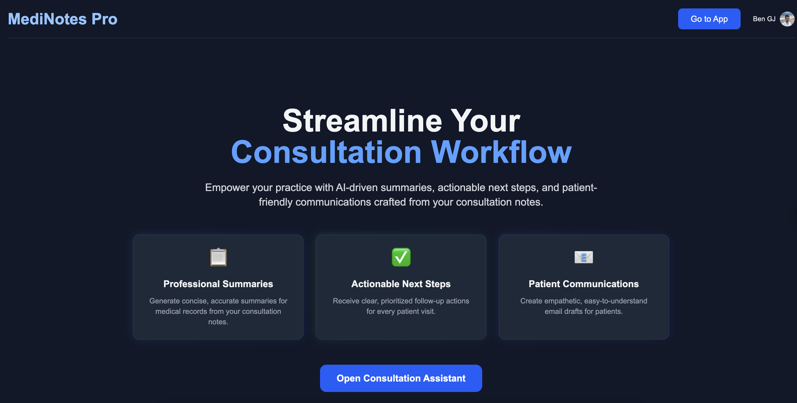

# Healthcare Consultation Assistant

A SaaS platform that leverages AI to provide healthcare consultation services. The platform integrates a healthcare consultation assistant that helps doctors generate patient summaries, action items, and patient-friendly emails from their visit notes.

**A healthcare application that**:

- Takes doctor's consultation notes as input

- Generates professional summaries for medical records

- Creates actionable next steps for the doctor

- Drafts patient-friendly email communications

- Uses structured forms with date pickers

- Streams AI-generated content in real-time

---

## Overview

The project consists of a frontend built with Next.js and Tailwind CSS, and a backend powered by FastAPI. The AI functionalities are implemented using OpenAI's GPT-4 model. User authentication is managed through Clerk.

## Features

- **User Authentication**: Secure sign-in and sign-up using Clerk.

- **AI-Powered Summarization**: Utilizes GPT-4 to generate summaries, action items, and emails based on doctor's notes.

- **Real-Time Streaming**: Implements real-time streaming of AI-generated content for a seamless user experience.

- **Structured Forms**: Uses structured forms with date pickers for better data input.

- **Responsive Design**: Built with Tailwind CSS for a modern and responsive user interface.

---