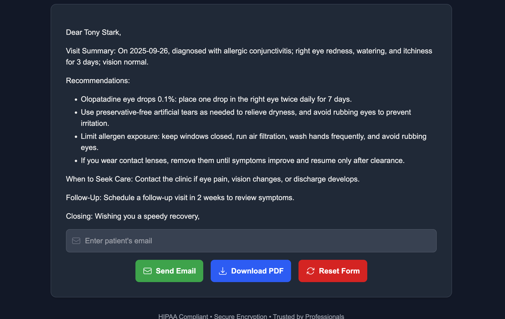
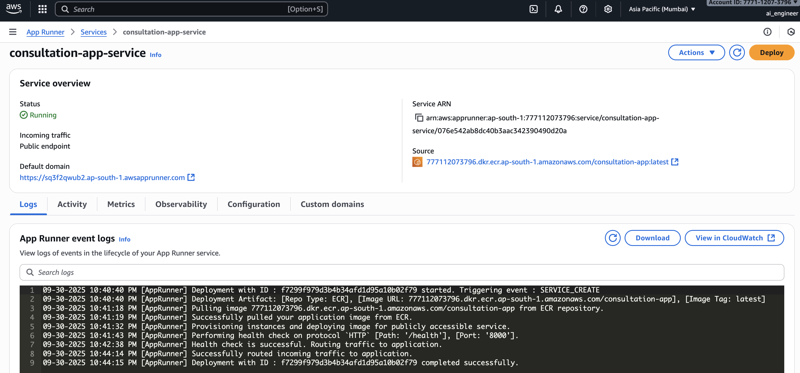

# HealthLetter - Healthcare Consultation Assistant

A SaaS platform that empowers healthcare professionals with AI-driven tools to streamline consultation workflows. 

`HealthLetter` transforms doctors' raw visit notes into
 professional summaries, actionable next steps, and patient-friendly email communications, enhancing efficiency and patient engagement.

## Key Features

- **AI-Powered Summarization**: Leverages OpenAI's GPT-5 to generate concise, professional summaries and actionable care plans from consultation notes.

- **Patient-Friendly Emails**: Crafts clear, empathetic emails for patients, summarizing visits and providing tailored recommendations.

- **Real-Time Streaming**: Delivers AI-generated content instantly via server-sent events for a seamless user experience.

- **Structured Input Forms**: Includes intuitive forms with date pickers for accurate and efficient data entry.

- **Secure Authentication**: Integrates Clerk for robust user sign-in, sign-up, and session management.

- **Responsive Design**: Built with Tailwind CSS for a modern, mobile-friendly interface.

- **HIPAA-Compliant**: Ensures secure data handling with encryption and compliance with healthcare regulations.

---

## Overview




---

## Tech Stack

- **Frontend**: Next.js (React framework), Tailwind CSS, Framer Motion (animations)

- **Backend**: FastAPI (Python), server-sent events for real-time streaming

- **AI**: OpenAI GPT-5 for natural language processing

- **Authentication**: Clerk for secure user management

- **Libraries**: React-Datepicker, React-Markdown, jsPDF

- **Deployment**: Vercel (recommended for Next.js)

---

## Example Usage

1. **Log In**: Sign in using Clerk authentication.

2. **Enter Consultation Details**:

   - Input patient name, visit date, doctor name, clinic name, and consultation notes.

   - Example notes: "Patient reports eye redness, itching for 3 days; diagnosed with allergic conjunctivitis."

3. **Generate Output**:
   - Click `Generate Email` to create a patient-friendly email, summary, and next steps.
   
   - Example output:
     ```
     Dear Patient Name,

     On 2025-09-26, you reported eye redness and itching, diagnosed as allergic conjunctivitis.
     - Use olopatadine 0.1% eye drops twice daily.
     - Apply cold compresses; avoid allergens.
     - Wash hands, avoid rubbing eyes.
     Contact the clinic if symptoms persist beyond 7 days.
     Schedule a follow-up if needed.
     Wishing you a speedy recovery,
     ```
4. **Send or Export**:
   - Enter the patient's email and click "Send Email" or "Download PDF" to share the summary.

    

## Project Structure

```
healthcare-consultation-assistant/
├── frontend/
│   ├── pages/
│   │   ├── index.tsx      # Homepage
│   │   ├── product.tsx    # Consultation assistant page
│   ├── public/
│   ├── styles/
│   └── .env.local         # Frontend environment variables
├── backend/
│   ├── api/      
    |   ├── index.py       # FastAPI application
    |   ├── server.py      # FastAPI server
│   ├── .env               # Backend environment variables
├── assets/
│   └── screenshots.png     # App screenshots
└── README.md
```

## Deployment

- We have dockerized both the frontend and backend for easy deployment.

- Using `AWS ECR` we have containerized the application for scalable deployment.

- Using `AWS App Runner` we have deployed the application for easy access.




## Contributing
To contribute:
1. Fork the repository.
2. Create a feature branch (`git checkout -b feature/your-feature`).
3. Commit changes (`git commit -m 'Add your feature'`).
4. Push to the branch (`git push origin feature/your-feature`).
5. Open a pull request.

## License
This project is licensed under the MIT License. See the [LICENSE](LICENSE) file for details.

## Contact
For questions or support, contact us at [HealthLetter Support](mailto:bengj1015@gmail.com) or open an issue on GitHub.

---
